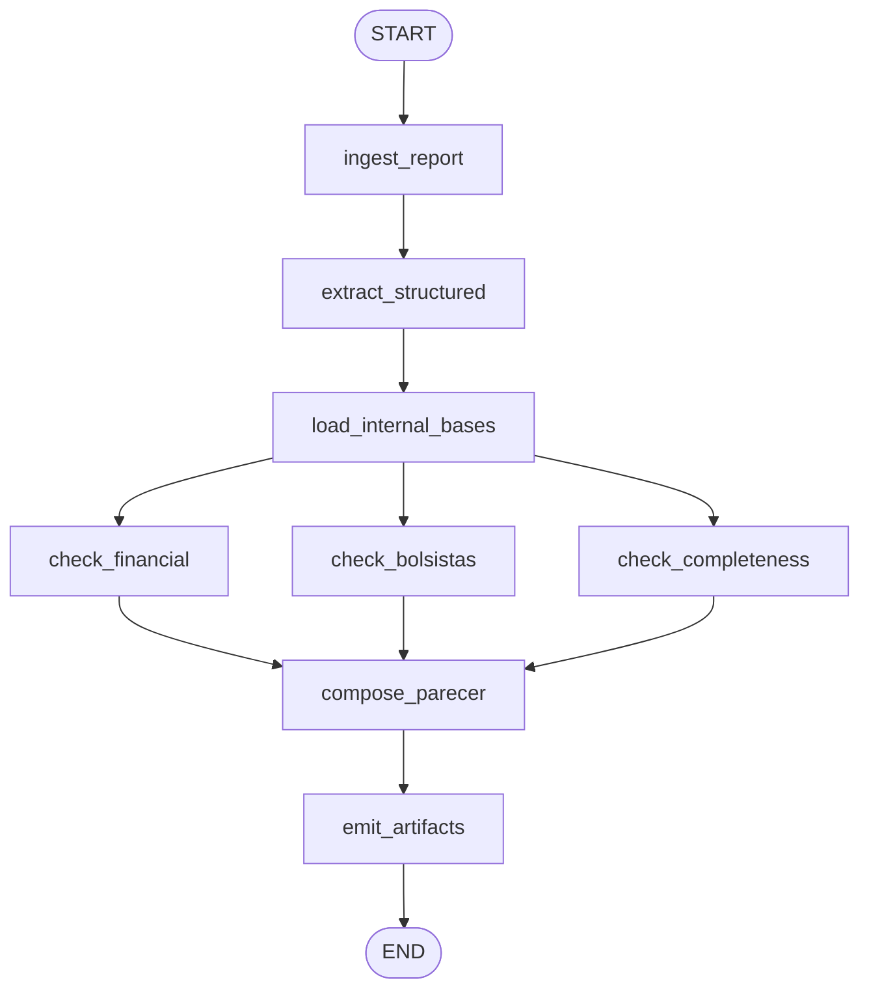

# Processo 3.4 — PROECE: Análise Automatizada de Relatórios de Ações de Extensão

## Visão Geral

Este projeto implementa um agente inteligente baseado em **LangGraph** para automatizar a análise de relatórios de ações de extensão submetidos à PROECE/UFMS.

O sistema recebe relatórios em PDF ou DOCX, extrai os dados estruturados, valida informações internas do projeto e gera automaticamente:

* parecer técnico;
* divergências encontradas;
* minuta de e-mail;
* consolidação de auditoria;
* rastreabilidade completa da execução.

O objetivo é reduzir o tempo de análise manual, padronizar decisões e aumentar a confiabilidade da auditoria documental.

---

# Objetivo do Processo 3.4

O processo automatizado corresponde à etapa de:

> **Análise de Relatórios de Ações de Extensão (PROECE)**

O agente verifica se os relatórios enviados pelos coordenadores:

* possuem todas as seções obrigatórias;
* apresentam coerência financeira;
* possuem bolsistas válidos;
* respeitam carga horária mínima;
* apresentam informações suficientes para aprovação.

Ao final, o sistema decide entre:

* `APROVAR`
* `DEVOLVER PARA AJUSTES`
* `DEVOLVER PARA REELABORAÇÃO`

---

# Arquitetura Geral

O sistema foi construído usando:

* Python 3.12+
* LangGraph
* LLM para extração estruturada
* Pipeline orientada a nós
* Execução paralela de verificações
* Logs estruturados

---

# Desenho do Grafo do Agente



---

# Estrutura do Projeto

```text
.
├── data/
│   ├── relatórios PDF/DOCX
│   ├── edital_bolsistas.csv
│   ├── fomentos_concedidos.csv
│   └── gabarito.csv
│
├── nodes/
│   ├── ingest_report.py
│   ├── extract_structured.py
│   ├── load_internal_bases.py
│   ├── check_financial.py
│   ├── check_bolsistas.py
│   ├── check_completeness.py
│   ├── compose_parecer.py
│   └── emit.py
│
├── output/
│   ├── pareceres
│   ├── jsons
│   ├── e-mails
│   └── consolidado_auditoria.xlsx
│
├── prompts/
├── tests/
├── utils/
├── graph.py
├── state.py
├── run_graph.py
└── requirements.txt
```

---

# Fluxo Completo do Agente

## 1. Ingestão do Relatório

Arquivo: `nodes/ingest_report.py`

Responsável por:

* carregar PDFs e DOCXs;
* extrair texto bruto;
* normalizar conteúdo;
* preencher o estado inicial do agente.

Saída:

* texto bruto;
* metadados do relatório;
* estado inicial estruturado.

---

## 2. Extração Estruturada

Arquivo: `nodes/extract_structured.py`

O agente utiliza prompts e LLM para transformar o relatório textual em uma estrutura padronizada.

São extraídos:

* coordenador;
* bolsistas;
* recursos financeiros;
* atividades;
* carga horária;
* seções obrigatórias;
* prestação de contas.

A estrutura extraída é validada usando o schema definido em `state.py`.

---

## 3. Carregamento das Bases Internas

Arquivo: `nodes/load_internal_bases.py`

Carrega os CSVs internos utilizados nas validações:

* base de fomentos concedidos;
* base oficial de bolsistas.

Essas bases funcionam como fonte de verdade institucional.

---

## 4. Verificações Paralelas

O LangGraph executa múltiplas auditorias simultaneamente.

### 4.1 Verificação Financeira

Arquivo: `nodes/check_financial.py`

Valida:

* coerência de valores;
* existência de recursos;
* divergências financeiras;
* inconsistências de prestação de contas.

---

### 4.2 Verificação de Bolsistas

Arquivo: `nodes/check_bolsistas.py`

Valida:

* CPF;
* vínculo;
* período;
* existência do bolsista na base oficial.

---

### 4.3 Verificação de Completude

Arquivo: `nodes/check_completeness.py`

Valida:

* presença das seções obrigatórias;
* qualidade textual mínima;
* carga horária declarada;
* coerência das atividades.

---

## 5. Composição do Parecer

Arquivo: `nodes/compose_parecer.py`

Consolida todos os resultados da auditoria.

O agente decide automaticamente:

* aprovar;
* devolver para ajustes;
* devolver para reelaboração.

Também gera:

* parecer em Markdown;
* JSON estruturado;
* justificativas;
* minuta de e-mail.

---

## 6. Emissão de Artefatos

Arquivo: `nodes/emit.py`

Responsável por salvar:

* parecer final;
* JSON de auditoria;
* e-mail;
* planilha consolidada.

Tudo é armazenado automaticamente na pasta `output/`.

---

# Estado Compartilhado do Agente

Arquivo: `state.py`

O projeto utiliza um estado global compartilhado entre os nós do LangGraph.

Principais entidades:

## RecursoFinanceiro

Representa os recursos financeiros declarados no relatório.

## Bolsista

Representa um bolsista associado ao projeto.

## Atividade

Representa uma atividade executada.

## Secoes

Representa todas as seções textuais obrigatórias.

## CheckResult

Representa o resultado de uma verificação.

## AgenteState

Estrutura central compartilhada por toda a pipeline.

---

# Orquestração do Grafo

Arquivo: `graph.py`

O arquivo cria o workflow usando `StateGraph`.

Fluxo:

1. ingest
2. extract
3. load_bases
4. verificações paralelas
5. compose
6. emit

O uso de paralelismo reduz tempo de execução e melhora escalabilidade.

---

# Execução Principal

Arquivo: `run_graph.py`

Responsável por:

* localizar relatórios;
* criar IDs únicos de execução;
* compilar o grafo;
* executar auditorias em lote;
* registrar logs estruturados.

---

# Como Executar o Projeto

## 1. Clone o repositório

```bash
git clone <repo>
cd Hackathon_LIA_time2_Processo3.4
```

---

## 2. Crie o ambiente virtual

Linux/macOS:

```bash
python -m venv venv
source venv/bin/activate
```

Windows:

```bash
python -m venv venv
venv\\Scripts\\activate
```

---

## 3. Instale as dependências

```bash
pip install -r requirements.txt
```

---

## 4. Configure as variáveis de ambiente

Crie um arquivo `.env`:

```env
OPENAI_API_KEY=sua_chave
```

---

## 5. Execute o sistema

```bash
python run_graph.py
```

---

# Saídas Geradas

Para cada relatório processado:

```text
output/
└── relatorio_xx/
    ├── dados_auditoria.json
    ├── parecer_auditoria.md
    └── minuta_email.txt
```

Além disso:

```text
output/consolidado_auditoria.xlsx
```

---

# Logs Estruturados

Arquivo:

```text
logs/agente_execucoes.jsonl
```

Cada execução possui:

* UUID;
* timestamp;
* arquivo processado;
* decisão final;
* eventos do pipeline.

Isso permite rastreabilidade completa.

---

# Testes

Pasta:

```text
tests/
```

Testes existentes:

* ingestão de relatórios;
* carregamento das bases.

Executar:

```bash
pytest
```

---

# Evidências de Funcionamento

## Funciona?

Sim.

O agente executa ponta a ponta:

1. lê relatórios reais;
2. extrai conteúdo;
3. realiza auditorias;
4. produz parecer;
5. gera artefatos finais.

A pasta `output/` contém execuções reais já processadas.

Exemplos:

* `relatorio_06_OK.pdf`
* `relatorio_11_OK.docx`
* `relatorio_30_E3.pdf`

---

# O que o agente faz e por que isso importa?

O agente automatiza a etapa de auditoria técnica da PROECE.

Antes da automação, a análise exigia:

* leitura manual dos relatórios;
* validação cruzada de bolsistas;
* conferência financeira;
* verificação de carga horária;
* elaboração manual de pareceres.

Com o agente:

* o processo torna-se padronizado;
* reduz-se o tempo operacional;
* melhora-se a rastreabilidade;
* aumenta-se a consistência das decisões.

O impacto principal é permitir que a equipe da PROECE foque em análises estratégicas e não em tarefas repetitivas.

---

# Como reproduzir?

Pré-requisitos:

* Python 3.12+
* pip
* chave de API configurada

Passos:

```bash
git clone <repo>
cd Hackathon_LIA_time2_Processo3.4
python -m venv venv
source venv/bin/activate
pip install -r requirements.txt
python run_graph.py
```

Os resultados aparecerão automaticamente na pasta `output/`.

---

# Quão bem funciona?

O projeto utiliza um conjunto de relatórios sintéticos contendo:

* casos válidos (`OK`)
* inconsistências financeiras (`E4`)
* erros de bolsistas (`E1`)
* problemas de completude (`E2`)
* inconsistências diversas (`E3`, `E5`, `E6`)

## Evidências empíricas

| Categoria | Objetivo                             |
| --------- | ------------------------------------ |
| OK        | Aprovação correta                    |
| E1        | Detectar inconsistência de bolsista  |
| E2        | Detectar incompletude                |
| E3        | Detectar divergências estruturais    |
| E4        | Detectar inconsistências financeiras |
| E5        | Detectar problemas de horas/execução |
| E6        | Detectar inconsistências críticas    |

---

# Métricas Observadas

## Pontos fortes

* Pipeline totalmente funcional;
* Paralelismo com LangGraph;
* Estrutura modular;
* Logs rastreáveis;
* Geração automática de pareceres.

## Limitações

* Dependência de qualidade do OCR;
* Sensibilidade a PDFs muito mal formatados;
* Dependência de LLM para extração.

---

# Tecnologias Utilizadas

* Python
* LangGraph
* OpenAI API
* Pandas
* PDFPlumber
* python-docx
* dotenv
* pytest

---

# Diferenciais Técnicos

## Execução Paralela

As verificações acontecem simultaneamente.

## Estado Compartilhado

Todos os nós compartilham um estado único tipado.

## Rastreabilidade

Cada execução possui UUID único.

## Modularidade

Cada auditoria está isolada em um nó independente.

---

# Possíveis Evoluções

* Dashboard web;
* Interface Streamlit;
* Banco de dados institucional;
* RAG com normativas;
* Assinatura automática de pareceres;
* Integração direta com SEI/SIGProj.

---

# Conclusão

O projeto demonstra uma arquitetura moderna de agentes baseada em grafos para automação documental institucional.

A solução atende aos objetivos do Processo 3.4 da PROECE ao:

* automatizar auditorias;
* aumentar consistência;
* reduzir esforço operacional;
* gerar documentação rastreável;
* produzir pareceres padronizados.

A arquitetura modular baseada em LangGraph permite expansão futura para novos processos administrativos da UFMS.
